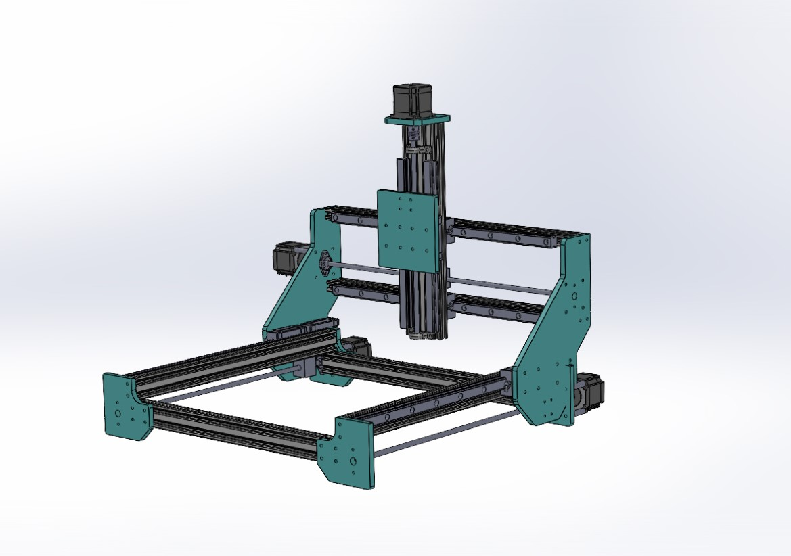

GrabCAD: [https://grabcad.com/library/cnc-machine-17](https://grabcad.com/library/cnc-machine-17)

**Introduction**

Ever wondered how a CNC machine works or dreamed of building one yourself? CNC machines are marvels of modern technology, allowing for precise cutting, drilling, and machining of various materials. In this post, I'll share my journey of building a CNC machine from scratch, the challenges I faced, and how you can create your own.

**Planning and Design**

**Inspiration**: My fascination with CNC technology began with customer requests and my own interest in the field. I decided to build a CNC machine to explore this technology further and meet those demands.

**Research**: Before starting the project, I studied CNC axis guiding systems, moving mechanisms, CNC controllers, and other machines to understand the components and materials used. 

**Design Choices**: I used Mach3 as the control board due to its balance of cost and functionality. For stability and durability, I chose linear railing guides and lead screws for axis movements, powered by Nema23 stepper motors. I designed the machine using SolidWorks, allowing me to visualize and adjust the design before implementation.

**Components and Materials**

- **Frame**: Aluminum extrusions
- **Motors**: Nema23 stepper motors
- **Controller**: Mach3 control board
- **Guides**: Linear railing guides
- **Axis Movement**: Lead screws
- **Gantry Plates**: Acrylic sheets
- **Sensors**: Inductive proximity sensors for homing and limit switches
- **Motor Drives**: TB6600 controllers

These materials were sourced from various online retailers and specialized CNC supply stores.

**Building Process**

**Frame Construction**: I designed acrylic plates to mount the aluminum extrusions, assembling the frame using nuts, bolts, and tapping threads where necessary.

**Mechanical Assembly**: Lead screws were mounted to the frame using bearings and attached to the axis gantry plate using a nut and nut seat housing.

**Electrical Components**: Wiring was done using auto wires, which were run through drag chains for organization and protection. The Mach3 control software was configured to be compatible with my setup, including tuning the motors and configuring the limit switches.

**Software Setup**: Setting up Mach3 involved configuring the software for my specific device, tuning motor settings, and configuring limit switches to ensure accurate operation.

**Testing and Calibration**

**Initial Tests**: I manually moved the axes to ensure the dimensions and directions were correct for all axes. I also chose appropriate jog speed, acceleration, and velocity values.

**Calibration**: I checked the motor operations, monitored their temperature, and adjusted the current limits to ensure optimal performance.

**Projects and Applications**

**First Project**: This was not my first CNC project, but it was my first 3-axis CNC machine. Through this project, I learned a lot and felt very satisfied with the outcome.

**Other Applications**: This CNC machine is designed for working with wood and plastics, but its applications can extend to various materials depending on the tools and settings used.

**Tips and Advice**

**Tips for Beginners**: Refer to parts datasheets to understand the materials and mechanical parts suitable for your application. Choose mechanisms based on your intended use—for instance, a lightweight, fast-moving mechanism for a laser head versus a heavier, sturdier build for engraving, milling, or drilling.

**Maintenance**: Regularly check and tighten all bolts and screws. Keep the linear rails clean and lubricated to ensure smooth operation.

**Conclusion**

Building a CNC machine is a challenging but immensely rewarding project. It’s a journey filled with learning and problem-solving, culminating in a tool that can bring your digital designs to life. I encourage you to dive in and start your own CNC adventure. If you have any questions or want to share your own build, drop a comment below!
